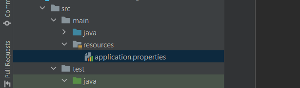

# Fluent Telegram bot Library

library designed for creating telegram bot through annotations. For Java 17 and above. Very easy and convenient.

## 1. Step to create a bot



If there is an application.properties file, you enter these values into it. If not, then create it in the resources 
folder and enter the values that should be included.

```properties
bot.token=your-bot-token
bot.username=your-bot-username
```

## 2. Step

in the second step, call the method named start in FluentStarter.start() class in the main method. Annotate this class 
with the name HandlerScanner and enter in it the full name of the package that declares the handlers.

```java
@HandlerScanner(value = "org.khasanof")
public class Start {

    public static void main(String[] args) {
        FluentStarter.start();
    }

}
```

## 3. Step 

The last step is to declare the Handler class and write a method in this class in one of the @HandleMessage or 
@HandleCallback annotations. The Sender interface must always be entered as a method parameter!

```java
@HandleMessage(value = "/start")
private void start(Sender sender) {
    String text = "Hello World!";
    MessageBuilder messageBuilder = new MessageBuilder()
        .message(text);
    sender.execute(messageBuilder);
}
```

```java
@HandleCallback(value = "BOOM")
private void callBack(Sender sender) {
    String text = "<b> Choose bot language: </b>";
    MessageBuilder messageBuilder = new MessageBuilder()
        .message(text)
        .parseMode("html");
    sender.execute(messageBuilder);
}
```

source code example [link](src/test/java/org/khasanof)
