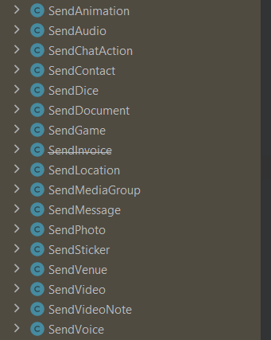

= Fluent 1.0.0
:author: Xasanov Nurislom
:email: khasanof373@gmail.com
:localdate: 2023-09-03

== Preface

Ushbu Fluent librarysi sizga Spring framework bilan birgalikda telegram bot yozishingizni ancha osonlashtiradi.
Telegram bot yasash juda oson va chunarli sababi siz endi ushbu librarydan foydalanish orqali siz faqat annoatatsiyalarni
o'zi bilan bot yozishingiz mumkin.

Ushbu Fluent library ichki `https://github.com/rubenlagus/TelegramBots[telegrambots]` librarysidan foydalangan.

== 1. Set Up

Ushbu bo'limda kod yozishgacha bo'lgan jarayoncha nimalarni qilishingiz kerakligi bilib olasiz.

=== 1.1 System Requirements

Ushbu fluent librarysidan foydalanish uchun Java 17 versiyasi va Spring boot-ni 3.1 dan baland versiyasi bo'lishi kerak.

=== 1.2 Dependency

Fluent dan foydalanish uchun POM faylingizga quyidagi depedency qo'shishingiz kerak.

.Maven
[source,xml]
[subs=attributes+]
----
<dependency>
    <groupId>org.khasanof</groupId>
    <artifactId>spring-boot-starter-fluent</artifactId>
    <version>1.0.0</version>
</dependency>
----

.Gradle
[source,groovy,indent=0]
[subs=attributes+]
....
dependencies {
    implementation 'org.khasanof:spring-boot-starter-fluent:1.0.0'
}
....

=== 1.3 Configuration

Tepadagi dependency-larni qo'shib bo'lganimizdan so'ng application yaml yoki properties filega botimizni token va username-ni ko'ratishimiz kerak bo'ladi.

.properties
[source,properties,indent=0]
[subs=attributes+]
....
fluent.bot.token=<your bot token>
fluent.bot.username=<your bot username>
fluent.bot.process-type=both
....

.yml
[source,yaml,indent=0]
[subs=attributes+]
....
fluent:
  bot:
    token: <your bot token>
    username: <your bot username>
    process-type: both
....

`token` va `username` tashqari `process-type` ham ko'rsatilgan u haqida pastgi bo'limlar to'liq tushintirilgan.

== 2. Using Simple Examples

Ushbu bo'limda telegram botga kelgan updatelarni Handler-lar yordamida qanday ushlashni bilib olamiz.

=== 2.1 Handle Message

Telegram botdan kelgan oddiy xabarni qanday qilib handle qilishni ushbu bo'limda ko'rib chiqamiz.

Quyidagi misolga qarang:

[source,java,indent=0]
[subs=attributes+]
....
@UpdateController
public class TestController {

    @HandleMessage("/start")
    public void test(Update update, AbsSender sender) throws TelegramApiException {
        String text = "start : " + update.getMessage().getText();
        SendMessage message = new SendMessage(update.getMessage().getChatId().toString(), text);
        sender.execute(message);
    }

}
....

`@UpdateController` annotatsiyasi updatelarni handle qiladigan classlarni ustiga qo'yish majburiy.
Ushbu annotatsiya classni update handle qilishi ko'rsatish uchun kerak.

`@HandleMessage` annotatsiyasiga kelsak.
Ushbu annotatsiya oddiy message sifatida kelgan updatelarni berilgan qiymatga mos kelgan taqdirdagina methodga kiritadi.
Yani botga `/start` xabar yuborilgandagina ushbu method ishlaydi.

`Update` esa bu bot-dan kirib kelgan update undan o'zimizga kerakli barcha narsalarni olib ishlatishimiz mumkin.

`AbsSender` esa bu ushbu bot-dan kelgan update-ga javob tariqasida xabar yoki istalgan boshqa narsa yubormoqchi bo'lganimizda ishlatishimiz uchun kerak bo'ladigan jo'natuvchi yani sender.

=== 2.2 Handle Callback

2.2 bo'limda esa callbacklarni qanday qilib handle qilishni bilib olasiz.

Quyidagi misolga qarang:

[source,java,indent=0]
[subs=attributes+]
....
@UpdateController
public class TestController {

    @HandleCallback(values = {"RU", "UZ"})
    private void callBack(Update update, AbsSender sender) throws TelegramApiException {
        String text = "I'm Callback Handler!";
        SendMessage message = new SendMessage(update.getCallbackQuery().getMessage()
            .getChatId().toString(), text);
        sender.execute(message);
    }

}
....

`@HandleCallback` annotatsiya nomidan ko'rinib turib callback sifatida kelgan update-larni handle qilish uchun ishlatishimiz mumkin.
Ushbu annotatsiya `String[]` qabul qiladi yani qaysi callbacklarni handle qilishini ushbu values methoddiga berish orqali ko'rsatishimiz mumkin.

=== 2.3 Callback and Message are multiple groups

Ushbu bo'limda tepada ishlatgan annotatsiyalarimizni bitta ko'plik variantlarni qanday yozishni bilib olamiz.

=== 2.3.1 Handle Callbacks

Quyidagi misolga qarang:

[source,java,indent=0]
[subs=attributes+]
....
@UpdateController
public class TestController {

    @HandleCallbacks(values = {
        @HandleCallback(values = {"NEXT", "PREV"}),
        @HandleCallback(values = {"TOP", "BOTTOM"}),
        @HandleCallback(values = {"LAST", "FIRST"})
    })
    private void multiCallback(Update update, AbsSender sender) throws TelegramApiException {
        String text = "I'm Callback Handler!";
        SendMessage message = new SendMessage(update.getCallbackQuery().getMessage()
            .getChatId().toString(), text);
        sender.execute(message);
    }

}
....

`@HandleCallbacks` annotatsiyasi bir nechta `@HandleCallback` annotatsiyalarni guruhlash uchun ishlatiladi.

=== 2.3.2 Handle Messages

Quyidagi misolga qarang:

[source,java,indent=0]
[subs=attributes+]
....
@UpdateController
public class TestController {

     @HandleMessages(values = {
            @HandleMessage(value = "start", scope = MatchScope.START_WITH),
            @HandleMessage(value = "end", scope = MatchScope.END_WITH),
            @HandleMessage(value = "boom", scope = MatchScope.EQUALS_IGNORE_CASE)
    })
    void multiMessageHandler(Update update, AbsSender sender) throws TelegramApiException {
        String text = "Hello Everyone! MultiHandler";
        SendMessage message = new SendMessage(update.getMessage().getChatId().toString(), text);
        message.setReplyMarkup(enterMenu());
        sender.execute(message);
    }

}
....

`@HandleMessages` annotatsiyasi ham huddi `@HandleCallbacks` bilan bir xil bir nechta faqat `@HandleMessage` annotatsiyasi guruhlash uchun ishlatiladi.

== 3. Handler Parameters

Ahamiyat bergan bo'lsangiz kerak deyarli barcha handler-larning kirib keluvchi parameterlarni bir xil tepadagi misol
larda. Ushbu bo'limda ushbu parameterlar haqida bilib olasiz.

=== 3.1 *Update* Parameter

Ushbu `Update` classi telegramdan kiruvchi update yani yangilanishini ifodalaydi. Har qanday update da ushbu classni
ichidagi istalgan ixtiyoriy parameterlardan faqat bittasi bo'lishi mumkin.

Ushbu update-dan o'zizmizga kerakli parameterlarni olib ishlatishimiz mumkin misol uchun xabar yuborish uchun yoki kirib
kelgan update-dan text olish uchun va hokazo-lar uchun.

[source,java,indent=0]
[subs=attributes+]
----
@HandleMessage("/start")
public void test(Update update, AbsSender sender) throws TelegramApiException {
    String text = "start : " + update.getMessage().getText(); <1>
    SendMessage message = new SendMessage(update.getMessage().getChatId().toString(), text); <2>
    sender.execute(message); <3>
}
----

<1> statementga e'tibor bersangiz kelgan updatedan messageni qanday qilib olish ko'rsatilgan.
<2> statementga e'tibor bersangiz ushbu statementda kelgan updatedan chatId olish ko'rsatilgan ushbu chatId bizga hali
juda ko'p kerak bo'ladi sababi chatId orqali biz ushbu kirib kelgan updatega javob qaytarish uchun foydalanamiz.
<3> ikkinchi va uchinchi statementda ko'rgan bo'lsangiz `SendMessage` classni instance yaratilgan chatId va textdan
foydalanib va ushbu classni `AbsSender` classni execute method foydalanib botga xabar yuborilgan.

=== 3.2 *AbsSender* Parameter

Ushbu `AbsSender` classi faqat bot ga xabar yuborish uchun ishlatiladi. Boshqacha qilib aytganda biz AbsSenderdan foydalanib
istalga formatdagi xabarimizni botga yuborishimiz mumkin misol uchun text, video, rasm, audio va hokazo.

AbsSender class 2ta asosiy methodlari bor ular `execute` va `executeAsync`.

ikkala methodlarni bir birdan farqi shundaki `execute` method current threaddan foydalanib botga xabar yuboradi.
`executeAsync` method esa boshqa thread ushbu ishni amalga oshiradi.

[source,java,indent=0]
[subs=attributes+]
....
sender.executeAsync(message, new SentCallback<Message>() {
    @Override
    public void onResult(BotApiMethod<Message> method, Message response) {
        // ...
    }

    @Override
    public void onError(BotApiMethod<Message> method, TelegramApiRequestException apiException) {
        // ...
    }

    @Override
    public void onException(BotApiMethod<Message> method, Exception exception) {
        // ...
    }
});
....

== 4. Send Message, Photo and etc

Ushbu 4 chi bo'lim botga har xil narsalarni yuborishni bilib olamiz.

=== 4.1 Send Message

Bot ga oddiy xabar yuborishni tepadagi misollarda ko'p kordik. Shunga uni qayta ko'rishimiz shart emas.
Endi kelgan update reply qilib javob yuborishni ko'ramiz, uning uchun biz ushbu `SendMessage` classni
`setReplyToMessageId` method foydalanib reply xabar yuborishimiz mumkin.

.Reply Message Example
image::images/ac163a6ce4803784b1.jpg[Wolpertinger,pdfwidth=50%,float=center,role=thumb]

.Following Example

[source,java,indent=0]
[subs=attributes+]
....
SendMessage message = new SendMessage(update.getMessage().getChatId().toString(), text);
message.setReplyToMessageId(update.getMessage().getMessageId()); <1>
sender.execute(message);
....

<1> `setReplyToMessageId` method qaysi message reply belgilashimiz uchun ushbu messageId si kerak bo'ladi.
Ushu kodda kelgan updatedagi message reply qilib botga xabar yuborilgan.

=== 4.1 Send Photo

Endi esa botga rasm yuborishni ko'ramiz.

Ushbu `SendPhoto` nomidan nima vazifa bajarishi ma'lum rasm yuborish uchun ishlatiladi. `SendPhoto` classi ham
`SendMessage` juda o'xshaydi. `SendPhoto` ni farqi shundaki u text o'ringa InputFile classni qabul qiladi.
InputFIle classi esa File qabul qiladi. Biz ushbu classga istalgan filimizni Urlni yoki `InpuStream` formatda file
berib yuborishimiz mumkin.

Following Example

[source,java,indent=0]
[subs=attributes+]
....
SendPhoto sendPhoto = new SendPhoto(update.getMessage().getChatId().toString(),
        new InputFile(new File("..."))); <1>
sender.execute(sendPhoto);
....

Send bilan boshlgan bir qancha classlardan foydalanib botga istalgan narsani yuborishimiz mumkin.
Pastdagi rasmda `Send` bilan boshlangan class ro'yxati ko'rsatilgan biz ushbu classlar tepada ko'rsatilgan 2tasidan
foydalanganimizga o'xshab foydalanishimiz mumkin. Qolgan `Send` classlarimizni pastdagi bo'limlarimizda birma bir
ko'rsatib ketamiz.

.Send Classes

